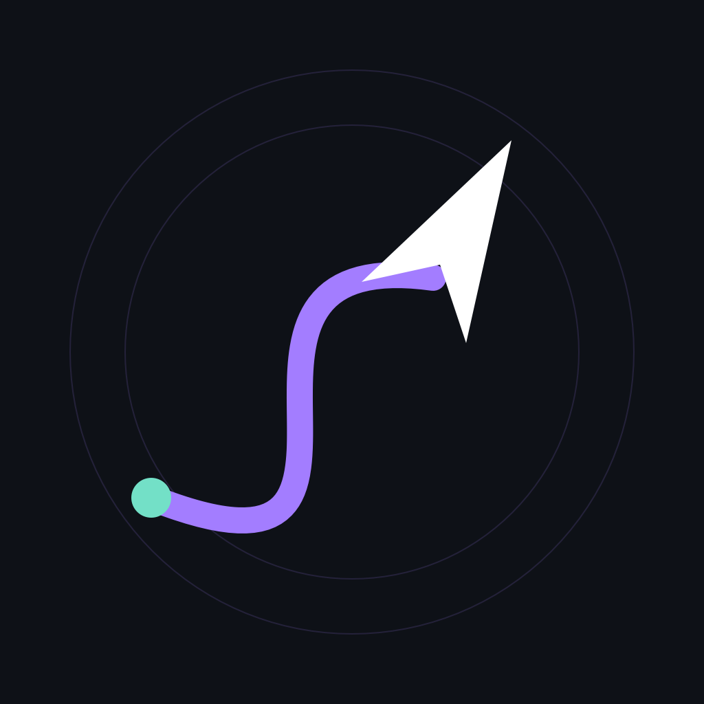
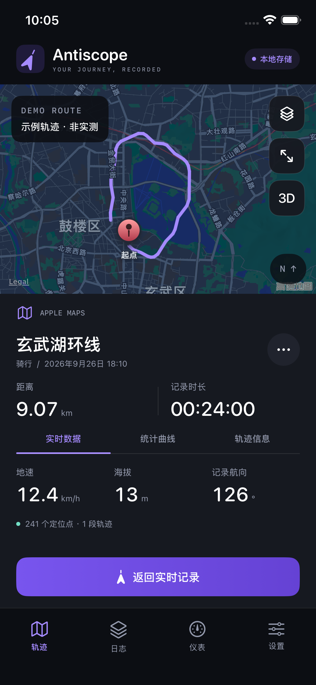
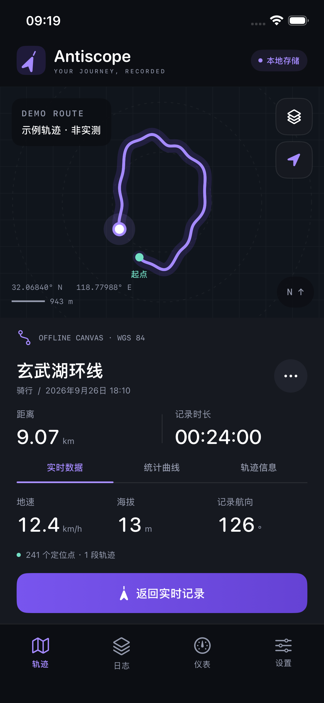

<div align="center">

# Altiscope

_A local-first journey recorder built with SwiftUI._

> Your journey, recorded.


</div>

<br clear="right" />

---

## Welcome

- Altiscope is a native journey recorder for iPhone and iPad, powered by GPS, compass and motion sensors.
  - Altiscope 是一款使用 GPS、指南针与运动传感器记录真实旅程的 SwiftUI 应用。
- No account is required. Your track log stays on the device until you choose to export it.
  - 无需注册账号；除非主动导出，轨迹日志默认只保存在本机。

> **命名说明：** Xcode 工程与 Target 名称为 **Altiscope**；当前应用界面、核心模块和导出文件仍沿用 **Antiscope** 名称。

## Feature

- **Easy to Use**
  - 选择步行、骑行、驾车或飞行，点击一次即可开始记录；支持暂停、继续与结束。
- **Local First**
  - 每段旅程以追加式 JSONL 日志保存，并在每次写入后同步落盘；无需账户或自建服务器。
- **Sensor Aware**
  - 记录 WGS 84 经纬度、海拔、地速、移动方向、手机朝向、定位精度与去重力三轴加速度。
- **Multiple Maps**
  - 支持离线轨迹画布、Apple 地图、高德地图与 Google Maps；切换底图不会改变原始轨迹数据。
- **Honest Tracking**
  - 过滤失效、乱序及明显不合理的定位；暂停或信号中断时自动断开轨迹段，不用直线补齐缺口。
- **Portable Records**
  - 可导出保留轨迹分段的 GPX 1.1，或包含完整定位与运动采样的 JSON。

## Preview

<p align="center">
  
  &nbsp;&nbsp;
  
</p>

> 截图中的路线是 **Demo Route**，不是真实行程。

## Quick Start

### Requirements

- macOS 与 Xcode；当前工程已在 **Xcode 26.3** 验证。
- iPhone 或 iPad，最低系统版本为 **iOS / iPadOS 17.6**。
- 真机记录需要允许精确定位；加速度功能需要可用的运动传感器。

### Build

1. 准备 Xcode 工程与地图依赖。

   仅使用离线画布与 Apple 地图：

   ```sh
   python3 Scripts/generate_project.py
   ```

   同时接入项目锁定版本的 Google Maps 与高德 SDK：

   ```sh
   python3 Scripts/fetch_sdks.py
   ```

   下载脚本使用地图提供方的官方分发地址，无需 CocoaPods 或 XcodeGen。

2. 如需第三方地图，创建本地配置文件：

   ```sh
   cp Config/Secrets.example.xcconfig Config/Secrets.xcconfig
   ```

   ```xcconfig
   GOOGLE_MAPS_API_KEY = your_google_ios_key
   AMAP_API_KEY = your_amap_ios_key
   DEVELOPMENT_TEAM = your_team_id
   ```

   API Key 应限制为最终使用的 Bundle Identifier；`Secrets.xcconfig` 已被 Git 忽略。

3. 打开 `Altiscope.xcodeproj`，选择 **Altiscope** Scheme，并在 Signing & Capabilities 中确认自己的开发团队与唯一 Bundle Identifier。
4. 选择模拟器或已解锁的真机，按 `⌘R` 构建运行。首次开始记录时，按系统提示授予定位与运动访问权限。
5. 没有真机时，可点击 **“浏览示例轨迹”** 查看地图、统计曲线和导出入口；模拟器不会伪造运动传感器读数。

## Map Providers

| 地图来源 | API Key | 离线能力 | 运行限制 |
|---|---:|---|---|
| **离线轨迹画布** | 不需要 | 轨迹、经纬网、缩放、拖动与比例尺 | 不包含街道底图 |
| **Apple 地图** | 不需要 | 底图不保证离线可用 | 使用系统 MapKit |
| **高德地图** | 需要 | 支持已获授权并预先下载的离线包 | 当前二进制仅用于真机；SDK 11.0+ 的离线地图需开通高阶服务 |
| **Google Maps** | 需要 | 本应用不提供离线区域下载 | 需在 Google Cloud 启用 Maps SDK for iOS |

第三方地图只有在用户阅读提示并主动启用后才会初始化。地图 SDK 会连接其提供方以加载当前视口；Altiscope 自身没有账户、服务器或轨迹上传接口。

## Recording & Privacy

- **Storage** — 记录保存在 `Application Support/Antiscope/Tracks`；一段旅程对应一个追加式 JSONL 文件。
- **Recovery** — 应用重启后，未结束的记录会恢复为暂停状态；若最后一次写入被截断，原文件会先备份再恢复。
- **Background** — 仅在记录期间启用后台定位。锁屏后可以继续接收系统允许的定位更新，但强制退出、重启设备或划掉应用后不能保证继续采样。
- **Motion** — 加速度来自 Core Motion 的 `userAcceleration`，目标采样率为 20 Hz，日志最多每秒保存一次；它不会被积分为推测位置。
- **Export** — GPX 使用 WGS 84 坐标并保留轨迹段；JSON 包含完整记录。卸载应用会删除本地数据，请提前导出需要保留的旅程。

## Project Structure

```text
App/
  Services/Recorder.swift       定位、指南针、运动与记录生命周期
  Maps/                         离线、MapKit、高德与 Google 地图适配
  Views/                        轨迹、日志、仪表、设置与统计图表
  Resources/                    权限说明、图标与隐私清单
Sources/AntiscopeCore/          数据模型、过滤、持久化与导出
Tests/AntiscopeCoreTests/       独立于 iOS UI 的核心测试
Config/                         构建设置与本地密钥模板
Documentation/                 设计参考、截图与验证记录
Scripts/                        SDK 下载与 Xcode 工程生成脚本
```

## Validation

```sh
swift test

xcodebuild -project Altiscope.xcodeproj -scheme Altiscope \
  -sdk iphonesimulator -destination 'generic/platform=iOS Simulator' \
  CODE_SIGNING_ALLOWED=NO build

xcodebuild -project Altiscope.xcodeproj -scheme Altiscope \
  -sdk iphoneos -destination 'generic/platform=iOS' \
  CODE_SIGNING_ALLOWED=NO build
```

当前记录的验证结果包括 **8 项 Swift 核心测试全部通过**，以及模拟器和未签名真机目标构建成功。详细范围与尚未完成的真机验收见 [Documentation/VALIDATION.md](Documentation/VALIDATION.md)。

> 模拟器构建通过不代表室外 GPS、指南针、磁干扰、长时间锁屏记录、耗电或第三方地图 Key 已在真实设备上完成验证。本项目不应作为测绘或航空导航仪表使用。

## Link

| 内容 | 链接 |
|---|---|
| 验证范围 | [Documentation/VALIDATION.md](Documentation/VALIDATION.md) |
| 设计参考说明 | [Documentation/volanta-reference.md](Documentation/volanta-reference.md) |
| Apple 后台轨迹示例 | [Displaying an updating path of a user's location history](https://developer.apple.com/documentation/mapkit/displaying-an-updating-path-of-a-user-s-location-history) |
| Google Maps iOS SDK | [Overview](https://developers.google.com/maps/documentation/ios-sdk/overview) |
| 高德 iOS SDK | [离线地图说明](https://lbs.amap.com/api/ios-sdk/guide/create-map/use-offlinemap) |

## Thanks

- [Volanta](https://volanta.app/features/) 为地图中心布局、轨迹视觉与日志信息层级提供了产品设计参考；Altiscope 是独立作品，与 Orbx / Volanta 无隶属关系。
- Apple 的 Core Location、Core Motion、MapKit 与 Swift Charts 提供了系统级能力。
- Google Maps SDK for iOS 与高德地图 iOS SDK 提供可选的第三方底图。

---

## License

第三方 SDK、地图数据、商标与资源遵循其各自的许可、服务条款和署名要求，`Vendor/` 中的内容不属于 Altiscope 的原创部分。


